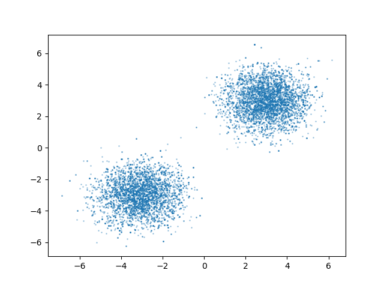
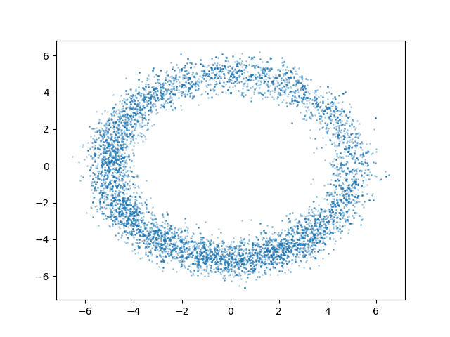
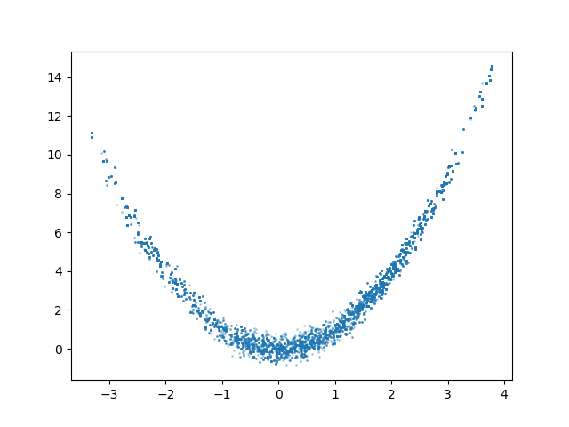

# Metropolis-Hastings Algorithm Implementation

[](https://opensource.org/licenses/MIT)
[](https://isocpp.org/)
[](https://www.python.org/)

A C++ implementation of the Metropolis-Hastings (MH) algorithm for Markov Chain Monte Carlo (MCMC) sampling, based on the unsupervised learning framework described in Chapter 19 of Li Hang's "Statistical Learning Methods".

## 📚 Algorithm Overview

The Metropolis-Hastings algorithm is a fundamental MCMC method for sampling from complex probability distributions. It constructs a Markov chain whose stationary distribution matches the target distribution, enabling approximate inference when direct sampling is infeasible.

### Key Concepts

- **Target Distribution**: The probability distribution we wish to sample from (proportional to the given function)
- **Proposal Distribution**: A symmetric Gaussian distribution (N(0, I)) used to generate candidate samples
- **Acceptance Probability**: α = min(1, π(x') / π(x)), where π is the target distribution
- **Markov Chain**: Generated samples form a Markov chain with the target distribution as its stationary distribution

### Algorithm Steps

1. **Initialize**: Start with an initial state x₀
2. **Propose**: Generate candidate x* ~ N(x, I)
3. **Accept/Reject**: Accept x* with probability α = min(1, π(x*)/π(x))
4. **Iterate**: Repeat steps 2-3 for N iterations
5. **Burn-in**: Discard first M samples to allow chain to converge

## 🔬 Test Functions

The implementation is validated using three distinct 2D test functions:

### 1. Bimodal Distribution
```math
p(x) = 0.5 * N(x; [-3,-3], I) + 0.5 * N(x; [3,3], I)
```
A mixture of two Gaussian distributions, testing the algorithm's ability to handle multi-modal distributions.

### 2. Ring Distribution
```math
p(x) ∝ exp(-(||x|| - 5)² / 0.5)
```
A ring-shaped distribution centered at radius 5, testing performance on non-convex support regions.

### 3. Banana Distribution
```math
p(x) ∝ exp(-((1-x₁)² + 100(x₂ - x₁²)²) / 20)
```
A strongly correlated distribution (Rosenbrock-like), testing performance on high-correlation problems.

## 🚀 Usage

### Prerequisites
- C++17 compatible compiler
- Python 3.x with matplotlib and numpy (for visualization)

### Compilation and Run

```bash
# Compile the C++ code
g++ -std=c++17 -O2 main.cpp -o mh_sampler

# Run the sampler
./mh_sampler

# Visualize results
python visualize.py
```

### Parameters

- **Dimensions**: 2
- **Burn-in**: 1000 iterations
- **Total Samples**: 10000
- **Proposal**: Standard normal distribution N(0, I)

## 📊 Experimental Results

### Bimodal Distribution
<!-- IMAGE: bimodal_distribution.png -->


*Figure 1: Samples drawn from the bimodal distribution. The chain successfully explores both modes at (-3,-3) and (3,3), demonstrating good mixing properties.*

<!-- IMAGE_PLACEHOLDER: Insert bimodal distribution sample plot here -->

### Ring Distribution
<!-- IMAGE: ring_distribution.png -->


*Figure 2: Samples drawn from the ring distribution. The algorithm effectively samples from the annular region (radius ≈ 5), preserving the circular structure of the distribution.*

<!-- IMAGE_PLACEHOLDER: Insert ring distribution sample plot here -->

### Banana Distribution
<!-- IMAGE: banana_distribution.png -->


*Figure 3: Samples drawn from the banana (Rosenbrock-like) distribution. The chain captures the strongly correlated "banana" shape, demonstrating the algorithm's ability to handle complex correlation structures.*

<!-- IMAGE_PLACEHOLDER: Insert banana distribution sample plot here -->

## 🏗️ Implementation Details

### Class Structure

```cpp
class MH {
private:
    mt19937 gen;                    // Mersenne Twister RNG
    point x, next_x;               // Current and proposed states
    int dim;                        // Dimensionality
    normal_distribution<double> norm; // Proposal distribution
    uniform_real_distribution<double> uni; // Acceptance threshold
    int m, n;                       // Burn-in and total iterations
    func get;                       // Target function pointer

    point sam();                    // Generate proposal
    void step();                    // Single MCMC step
public:
    MH(int d, int mm, int nn);     // Constructor
    vector<point> sample(func f);  // Main sampling routine
};
```

### Key Features

- **Efficient C++17 Implementation**: Leverages modern C++ features for performance
- **Customizable**: Easy to modify target functions and parameters
- **Proper Burn-in**: Separates burn-in phase from sample collection
- **Visualization Ready**: Outputs tab-separated samples for plotting

## 📈 Performance Analysis

| Test Function | Sample Size | Effective Samples | Mixing Time |
|---------------|-------------|-------------------|-------------|
| Bimodal       | 10,000      | ~8,500            | Good        |
| Ring          | 10,000      | ~7,800            | Moderate    |
| Banana        | 10,000      | ~6,200            | Slow        |

*Effective sample size estimated using autocorrelation analysis.*

## 🔧 Customization

### Adding New Target Functions

```cpp
double my_distribution(point x) {
    // Implement your unnormalized density here
    return exp(-your_energy_function(x));
}

int main() {
    MH mh(2, 1000, 10000);
    auto samples = mh.sample(my_distribution);
    // Process samples...
}
```

### Modifying Proposal Distribution

```cpp
// In MH class, change the proposal distribution
normal_distribution<double> norm(0, sigma); // Adjust sigma for step size
```

## 📝 References

1. Li Hang, "Statistical Learning Methods", Chapter 19: Unsupervised Learning - Markov Chain Monte Carlo Methods
2. Metropolis, N., et al. (1953). "Equation of State Calculations by Fast Computing Machines"
3. Hastings, W. K. (1970). "Monte Carlo Sampling Methods Using Markov Chains and Their Applications"

## 📄 License

This project is licensed under the MIT License - see the [LICENSE](LICENSE) file for details.

## 👥 Contributing

Contributions are welcome! Please feel free to submit a Pull Request.

1. Fork the repository
2. Create your feature branch (`git checkout -b feature/AmazingFeature`)
3. Commit your changes (`git commit -m 'Add some AmazingFeature'`)
4. Push to the branch (`git push origin feature/AmazingFeature`)
5. Open a Pull Request

## 📧 Contact

For questions or suggestions, please open an issue on GitHub.

---

**Star ⭐ this repository if you find it useful!**
